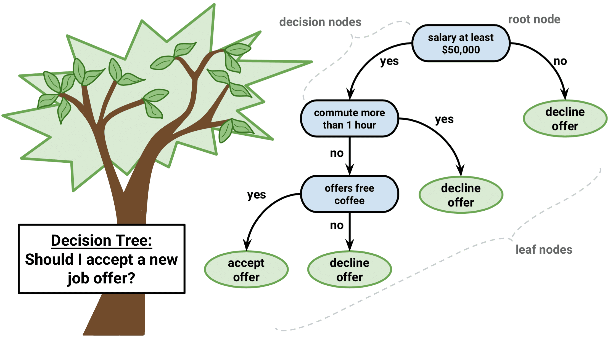
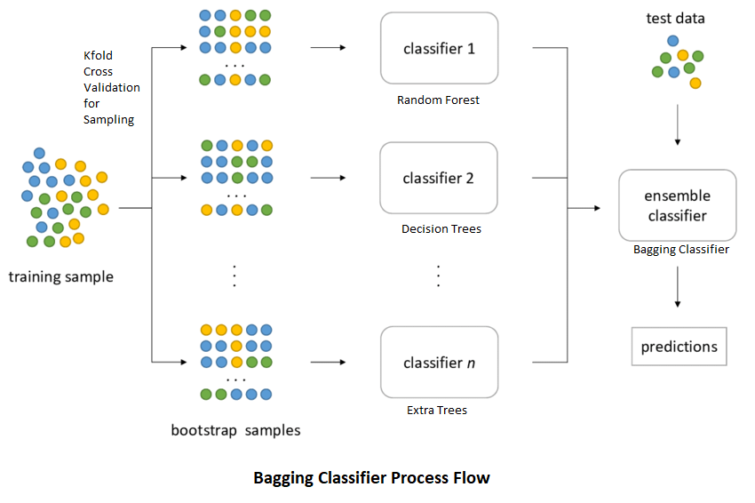
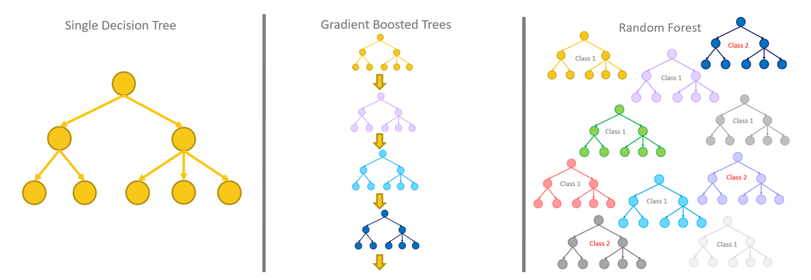
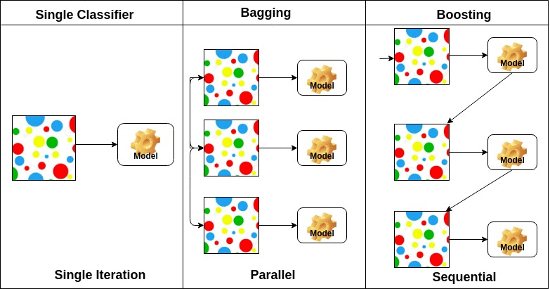
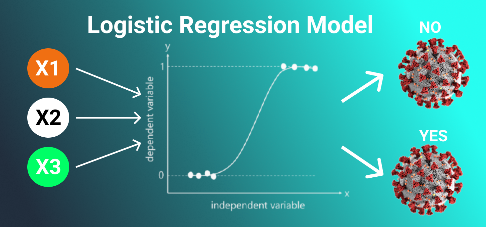

<style>
/* Your other css */
    body {
      background-image: url(https://images7.alphacoders.com/324/324782.jpg);
      background-position: center center;
      background-attachment: fixed;
      background-repeat: no-repeat;
      background-size: 100% 100%;
    }
.section .reveal .state-background {
    background-image: url(https://images7.alphacoders.com/324/324782.jpg);
    background-position: center center;
    background-attachment: fixed;
    background-repeat: no-repeat;
    background-size: 100% 100%;
}
</style>

<style>
div.blue pre.r { background-color:lightblue; }
</style>

<div class = "blue">
```{r setup, include=FALSE}
knitr::opts_chunk$set(echo = TRUE)
```

# **DECISION TREES (KARAR AGACLARI)**

```{r fotograf, echo=FALSE, message=FALSE, warning=FALSE}

```

Karar Agaclari, girdi kararlarina dayali sonuclar sunmak icin agac benzeri bir yapiyi kullanan populer bir Veri Madenciligi teknigidir. Karar agaclarinin onemli bir ozelligi, hem regresyon hem de siniflandirma icin kullanilmasidir. Bu tur bir siniflandirma yontemi, hem heterojen hem de eksik verileri isleyebilir. Karar Agaclari ayrica anlasilabilir kurallar uretme yetenegine de sahiptir. Boylece, siniflandirmalar cok fazla hesaplama yapilmadan gerceklestirilebilir.

Karar agaci, bir ic dugumun ozelligini (veya ozniteligi) , dalin bir karar kuralini ve her bir yaprak dugumun sonucunu temsil ettigi akis semasina benzer bir agac yapisidir.  
Bir karar agacindaki en ust dugum, kok dugum olarak bilinir.Oznitelik degerine gore bolumlemeyi ogrenir. Agaci, ozyinelemeli bolumleme cagrisi ile ozyinelemeli olarak boler. Bu akis semasi benzeri yapi, karar vermede bize yardimci olur. Bu nedenle karar agaclarinin anlasilmasi ve yorumlanmasi kolaydir.

## *KRONIK BOBREK HASTALIGI*
## *Kaynak:https://www.kaggle.com/abhia1999/chronic-kidney-disease?select=new_model.csv*

```{r  echo=FALSE, message=FALSE, warning=FALSE}

```

```{r message=FALSE, warning=FALSE}
library(readr)
library(dplyr)
library(neuralnet)

orj=read.csv("C:/Users/CASPER/Desktop/verimadenciligi/new_model.csv", header=T)
veri=orj%>%select(c("Bp","Sg","Bu","Sc","Sod","Pot","Hemo","Wbcc","Rbcc","Class"))
```

### *Veri Seti Aciklamasi;*

Bu veri kumesi, orijinal olarak UCI Makine Ogrenimi Havuzundan alinmistir.  
Veri setinin amaci, bir hastanin kronik bobrek hastaligina sahip olup olmadigini,veri setine dahil edilen belirli tanisal olcumlere dayanarak tahmin etmektir.  
Veri kumesi, birkac tibbi ongorucu degisken ve bir hedef degisken olan Class'tan olusur.  

Kronik bobrek hastaligi , bobrek islevinin uzun bir surecte ilerleyici kaybi ile karaterizedir. Bu islev kaybi kritik bir duzeye ulastiginda tum organlarini etkileyen ciddi saglik sorunlari ortaya cikmaktadir. Kronik bobrek hastalarinda olum ve ozurluluk riskleri saglikli bireylerden 10-30 kat daha yuksektir. Bu durumun yol actigi kotu yasam kalitesi hastalarin aile ve sosyal yasantilarini da olumsuz yonde etkilemektedir.   
Kronik bobrek hastaligi siklikla son evreye kadar sessiz bir sekilde ilerlemektedir genellikle erken evrelerde belirti vermemektedir.Bu nedenle hastalara erken evrelerde tani konulamamaktadir.Bunun dogal sonucu olarak bobrek hasarini onleyecek tedaviler icin cok gec kalinmakta, hastalar hizli ve dramatik olarak son evreye ilerlemektedirler.  

### *Degiskenler:*

* Bp(Kan Basinci): Kan basinci, dolasim sistemi atardamarlari icindeki kanin basincidir.Kan dolasimi icin gereken basincin normalden fazla olmasi anlamina gelen 'yuksek tansiyon'(hipertansiyon),kronik bobrek yetmezligi  hastalarinda oldukca yaygin gorulen bir klinik problemdir. 

* Sg(Idrar Yogunlugu): Idrar yogunlugu hakkinda bilgi verir,normal sinirlarin altina dusen degerler bobreklerin duzgun calismadiginin gostergesidir.

* Bu(Kan uresi): Kan ure azotu, yemek yedikten sonra vucudun atmak istedigi atik urundur.Bu ure azoru bobrekler yardimiyla idrarla atilir.Kan azot seviyesinin yuksek olmasi Bobrek hastaliklari,idrar yolu tikanikligi oldugunu gosterir.Kan azot seviyesinin yuksek olmasi yetersiz sividan kaynaklidir.Dusuk olmasi da zaralidir.

* Sc(Serum Kreatinin): Yuksek kreatinin seviyesi, bozulmus bobrek fonksiyonu veya bobrek hastaligi anlamina gelir. 

* Sod(Sodyum Miktari): Yuksek sodyum degeri bobreklerin islevinin azalmasina ve daha az su almasina neden olarak daha yuksek kan basincina neden olur.

* Pot(Potasyum Miktari):Potasyum bobreklerle atildigindan dolayi bobrek yetersizliginde kandaki potasyum yukselir.Dusuk olmasi da zaralidir.

* Hemo(Hemoglobin Miktari): Kisaca HGB olarak kisaltilan hemoglobin, kan sivisinda kirmizi kan hucrelerinin icinde yer alan bir proteindir. Hemoglobinin az olmasi anemiye sebep olur ve bu kronik bobrek hastaligina sebep olan etkenlerden biridir.

* Wbcc(Beyaz Kan Hucresi Sayimi): Yuksek beyaz kan hucresi (WBC) sayisi, kronik bobrek hastaliginin ilerlemesinin iyi bilinen bir gostergesidir.

* Rbcc(Kirmizi Kan Hucresi Sayimi): Kirmizi kan hucreleri, kendi yapisinin bir parcasi olarak demir icerir ve hemoglobin olusur.Kan hucresi sayisinin dusmesine ve aneminin gelismesine neden olur. Bobrek hastaligi olan cogu insan anemi gelistirir. 

* Class(Kronik Bobrek Hastaligi Durumu): Kronik bobrek hastaligi durumu 0 : Kronik bobrek hastaligi olma riski dusuk, 1:Kronik bobrek hastaligi olma riski yuksek.

Oncelikle verimizi ozetleyelim;

```{r message=FALSE, warning=FALSE}
summary(veri)
```

Verimizin ozetine baktigimizda Class degiskenimizi factor haline getirmeliyiz.

```{r message=FALSE, warning=FALSE}
veri$Class[which(veri$Class==1)]<- "Hasta"
veri$Class[which(veri$Class==0)]<- "HastaDegil"
```

Verimizdeki Class degiskeninde 1 olanlari "Hasta" ve 0 olanlari "HastaDegil" olarak isimlendirdik.

Class degiskenimizi factor haline getirelim;

```{r message=FALSE, warning=FALSE}
veri$Class <-factor(veri$Class)
summary(veri)
```

Verimizin ozetine baktigimizda verimizde 250 tane Hasta ve 150 tane HastaDegil yani hasta olmayan gozlem oldugunu gormekteyiz.

Verimizde missing gozlemler var mi yok mu apply komutuyla kontrol etmeliyiz; 

```{r message=FALSE, warning=FALSE}
apply(veri,2,function(x) sum(is.na(x)))#Her sutunda kac tane missing gozlem var bunu gorecegiz. Hepsi sifir ise problem yok.
```

Her sutunda kac tane missing gozlem var apply komutuyla goruluyor.  
Verimizin sutunlarina baktigimizda eksik gozlem olmadigi gozukmektedir bu nedenle bir problem yoktur.

Verimizde missing gozlem olup olmadigini grafikle gorsellestirmek istersek;

```{r message=FALSE, warning=FALSE}
library(naniar)
vis_miss(veri)
```

Grafigimize baktigimizda eksik gozlem olmadigi gozukmektedir bu nedenle bir problem yoktur.


Oncelikle verimizde karar agaclari uzerinde calismak icin **tree** kutuphanesi indirmeliyiz.Burada tree.veri kodu bu veri seti uzerinde binary splitting ile buyuk bir agac olusturmamizi saglar.

```{r message=FALSE, warning=FALSE}
library(tree)

tree.veri <- tree(Class~.,veri)
summary(tree.veri)
```

Summary kodumuzun ciktisina baktigimizda agacin insaasinda kullanilan verimizdeki degiskenlerin onem sirasini " Variables actually used in tree construction" ile gormekteyiz. Onem sirasi en yuksek olan degiskenimizin Hemo oldugu gorulmektedir.Sirasiyla Sc ve Sg, Hemo degiskenini takip etmektedir.   
Summary kodumuzun ciktisinda gozuken "Residual mean deviance" ise regresyondaki MSE degerimizin dengidir.Verimizde bu deger 0.07443 cikmistir.  
Ayni zamanda "Number of terminal nodes "ise bize terminal nod sayisini gostermektedir.Verimizde terminal nod sayisi 7 cikmistir.Ayrisim Sayisi+1 bize terminal nod sayisini vermektedir.Buradan ayrisim sayimiz 6 olarak bulunur.   
Ayriyeten "Misclassification error rate" yanlis siniflandirma hata oranimiz 0.0125 cikmistir.

Simdi verimiz icin olusturdugumuz  karar agacimizi cizdirelim ;

```{r message=FALSE, warning=FALSE}
plot(tree.veri)
text(tree.veri,pretty=0)
```

Varyansi ve karmasayi dusurmek icin budama yapiyoruz.Agaclarin daha az dallanmasini saglayarak varyanslari dusurebiliriz.Varyans ne kadar dusuk olursa yorumlanmasi daha kolay agaclar elde edilebilir.Agaclari budayarak varyansi dusurururuz ama gercek degerlerden uzaklasmis oluruz.Bu da yanliligin artmasina yani gercek yanitlardan modelin uzaklasmasina sebep olur.Varyans ile yanlilik arasindaki dengeyi crossvalidation ile bulmaliyiz.

Verimizi test ve train olarak iki gruba ayirarak olusturdugumuz karar agacinin test veri seti uzerindeki performansini inceleyelim.
Kullandigimiz veride 400 gozlem bulunmaktadir ve bu gozlemlerden 200 tanesini train olarak kullanalim.

```{r message=FALSE, warning=FALSE}
set.seed(2021)
train=sample(1:nrow(veri), 200)
veri.test=veri[-train,]

Class.test=veri$Class[-train]

tree.veri=tree(Class~.,veri,subset=train)
plot(tree.veri);text(tree.veri,pretty=0)
```

Test ve train olarak ayirarak olusturdugumuz karar agacimizin test verisi uzerindeki performansini incelersek;

## *Confusion Matrix*

```{r message=FALSE, warning=FALSE}
pred = predict(tree.veri,veri.test,type="class")

library(caret)
library(e1071)

cm <- confusionMatrix(table(veri.test[,10], pred))
draw_confusion_matrix <- function(cm) {
layout(matrix(c(1,1,2)))
par(mar=c(2,2,2,2))
plot(c(100, 345), c(300, 450), type = "n", xlab="", ylab="", xaxt='n', yaxt='n')
title('Confusion Matrix', cex.main = 2)
rect(150, 430, 240, 370, col = '#80aac2')
text(195, 435, 'Negatif', cex = 1.2)
rect(250, 430, 340, 370, col = '#fffdbf')
text(295, 435, 'Pozitif', cex = 1.2)
text(125, 370, 'Predicted', cex = 1.3, srt = 90, font = 2)
text(245, 450, 'Actual', cex=1.3, font=2)
rect(150, 305, 240, 365, col = '#fffdbf')
rect(250, 305, 340, 365, col = '#80aac2')
text(140, 400, 'Negatif', cex = 1.2, srt = 90)
text(140, 335, 'Pozitif', cex = 1.2, srt = 90)
res <- as.numeric(cm$table)
text(195, 400, res[1], cex = 1.6, font = 2, col = 'blue')
text(195, 335, res[2], cex = 1.6, font = 2, col = 'orange')
text(295, 400, res[3], cex = 1.6, font = 2, col = 'orange')
text(295, 335, res[4], cex = 1.6, font = 2, col = 'blue')
plot(c(100, 0), c(100, 0), type = "n", xlab="", ylab="", main = "DETAILS", xaxt = 'n', yaxt = 'n')
text(10, 85, names(cm$byClass[1]), cex=1.2, font=2)
text(10, 70, round(as.numeric(cm$byClass[1]), 3), cex=1.2)
text(30, 85, names(cm$byClass[2]), cex=1.2, font=2)
text(30, 70, round(as.numeric(cm$byClass[2]), 3), cex=1.2)
text(50, 85, names(cm$byClass[5]), cex=1.2, font=2)
text(50, 70, round(as.numeric(cm$byClass[5]), 3), cex=1.2)
text(70, 85, names(cm$byClass[6]), cex=1.2, font=2)
text(70, 70, round(as.numeric(cm$byClass[6]), 3), cex=1.2)
text(90, 85, names(cm$byClass[7]), cex=1.2, font=2)
text(90, 70, round(as.numeric(cm$byClass[7]), 3), cex=1.2)
text(30, 35, names(cm$overall[1]), cex=1.5, font=2)
text(30, 20, round(as.numeric(cm$overall[1]), 3), cex=1.4)
text(70, 35, names(cm$overall[2]), cex=1.2, font=2)
text(70, 20, round(as.numeric(cm$overall[2]), 3), cex=1.4)
}
op = par(bg = "honeydew")
draw_confusion_matrix(cm)
```

Bu matrise baktigimizda;   
Veride 122 tane Hasta var iken model bunlardan 117 tanesini dogru, 5 tanesini yanlis tahmin etmistir.   
Veride 78 tane HastaDegil var iken model bunlardan 74 tanesini dogru, 4 tanesini yanlis tahmin etmistir.   
Sensitivity degerimiz 0.959 olarak cikmistir  Specificity degerimiz 0.949 olarak cikmistir ve Kappa degerimiz 0.906 olarak cikmistir.

## *Decision Trees Accuracy* 

```{r message=FALSE, warning=FALSE}
AccuracyDecisionTrees<-(117+74)/200
AccuracyDecisionTrees
```

Ayni zamanda Confusion matrix tahminimiz ile hesapladigimiz Decision Trees Accuracy(dogruluk orani) degerimiz 0.955 cikmistir. 

# **PRUNING (BUDAMA)**

Bir karar dugumunun alt dugumlerini kaldirdigimizda bu isleme Budama adi verilir.Varyansi ve karmasayi dusurmek icin budama yapiyoruz.Agaclarin daha az dallanmasini saglayarak varyanslari dusurebiliriz.   
Varyans ne kadar dusuk olursa yorumlanmasi daha kolay agaclar elde edilebilir.Agaclari budayarak varyansi dusurururuz ama gercek degerlerden uzaklasmis oluruz.Bu da yanliligin artmasina yani gercek yanitlardan modelin uzaklasmasina sebep olur.Varyans ile yanlilik arasindaki dengeyi crossvalidation ile bulmaliyiz.


```{r message=FALSE, warning=FALSE}
set.seed(2021)
cv.veri=cv.tree(tree.veri,FUN=prune.misclass)
cv.veri
```

Cv.veri ciktimiza gore;    
"size" bize terminal nod sayisini gostermektir.    
"dev" Deviance olcutudur yani siniflandirma performansi ile ilgili bir metriktir.Deviance ne kadar dusukse o kadar iyidir. Burada deviancesi en dusuk olan sayiyi secerek terminal nodu belirlemeliyiz.Deviance en dusuk 9 olarak cikmistir bu da terminal nod 3 e karsilik gelmektedir.    
"k" ceza parametresidir. (cost complex)  

Misclassification Error(yanlis siniflandirma orani) icin grafigimizi cizdirelim;

```{r message=FALSE, warning=FALSE}
plot(cv.veri)
```

Misclassification Error icin cizdirdigimiz grafikte de goruldugu gibi yanlis siniflandirma orani en dusuk olan terminal nod 3 dur.

Terminal nodu 3 alarak budama agaci(Pruning Decision Trees) modelimizi kuralim;

```{r message=FALSE, warning=FALSE}
prune.veri=prune.misclass(tree.veri,best=3)
plot(prune.veri);text(prune.veri,pretty=0)
```

Budama(Pruning) yaparak olusturdugumuz karar agacimizi Decision Trees agacimizla karsilastirdigimizda terminal nod sayimiz dustugunden yorumlanmasi daha kolay bir agac modelimiz olusmustur.

Budama yaparak olusturdugumuz karar agacimizin test verisi uzerindeki performansini incelersek;

## *Confusion Matrix*

```{r message=FALSE, warning=FALSE}

pred = predict(prune.veri,veri.test,type="class")

library(caret)
library(e1071)

cm <- confusionMatrix(table(veri.test[,10], pred))
draw_confusion_matrix <- function(cm) {
layout(matrix(c(1,1,2)))
par(mar=c(2,2,2,2))
plot(c(100, 345), c(300, 450), type = "n", xlab="", ylab="", xaxt='n', yaxt='n')
title('Confusion Matrix', cex.main = 2)
rect(150, 430, 240, 370, col = '#ffb957')
text(195, 435, 'Negatif', cex = 1.2)
rect(250, 430, 340, 370, col = '#b3f77c')
text(295, 435, 'Pozitif', cex = 1.2)
text(125, 370, 'Predicted', cex = 1.3, srt = 90, font = 2)
text(245, 450, 'Actual', cex=1.3, font=2)
rect(150, 305, 240, 365, col = '#b3f77c')
rect(250, 305, 340, 365, col = '#ffb957')
text(140, 400, 'Negatif', cex = 1.2, srt = 90)
text(140, 335, 'Pozitif', cex = 1.2, srt = 90)
res <- as.numeric(cm$table)
text(195, 400, res[1], cex = 1.6, font = 2, col = 'darkgreen')
text(195, 335, res[2], cex = 1.6, font = 2, col = 'darkorange')
text(295, 400, res[3], cex = 1.6, font = 2, col = 'darkorange')
text(295, 335, res[4], cex = 1.6, font = 2, col = 'darkgreen')
plot(c(100, 0), c(100, 0), type = "n", xlab="", ylab="", main = "DETAILS", xaxt = 'n', yaxt = 'n')
text(10, 85, names(cm$byClass[1]), cex=1.2, font=2)
text(10, 70, round(as.numeric(cm$byClass[1]), 3), cex=1.2)
text(30, 85, names(cm$byClass[2]), cex=1.2, font=2)
text(30, 70, round(as.numeric(cm$byClass[2]), 3), cex=1.2)
text(50, 85, names(cm$byClass[5]), cex=1.2, font=2)
text(50, 70, round(as.numeric(cm$byClass[5]), 3), cex=1.2)
text(70, 85, names(cm$byClass[6]), cex=1.2, font=2)
text(70, 70, round(as.numeric(cm$byClass[6]), 3), cex=1.2)
text(90, 85, names(cm$byClass[7]), cex=1.2, font=2)
text(90, 70, round(as.numeric(cm$byClass[7]), 3), cex=1.2)
text(30, 35, names(cm$overall[1]), cex=1.5, font=2)
text(30, 20, round(as.numeric(cm$overall[1]), 3), cex=1.4)
text(70, 35, names(cm$overall[2]), cex=1.2, font=2)
text(70, 20, round(as.numeric(cm$overall[2]), 3), cex=1.4)
}
op = par(bg = "lightcyan")
draw_confusion_matrix(cm)
```

Bu matrise baktigimizda;     
Veride 126 tane Hasta var iken model bunlardan 119 tanesini dogru, 7 tanesini yanlis tahmin etmistir.  
Veride 74 tane HastaDegil var iken model bunlardan 72 tanesini dogru, 2 tanesini yanlis tahmin etmistir.   
Sensitivity degerimiz 0.944 olarak cikmistir  Specificity degerimiz 0.973 olarak cikmistir ve Kappa degerimiz 0.905 olarak cikmistir.

## *Pruning Accuracy* 

```{r message=FALSE, warning=FALSE}
AccuracyPruning<-(119+72)/200
AccuracyPruning
```

Ayni zamanda Confusion matrix tahminimiz ile hesapladigimiz Pruning Accuracy(dogruluk orani) degerimiz 0.955 cikmistir. 

# **BAGGING**

```{r , echo=FALSE, message=FALSE, warning=FALSE}

```

Bagging olarak da adlandirilan Bootstrap aggregating, istatistiksel siniflandirma ve regresyonda kullanilan makine ogrenimi algoritmalarinin kararliligini ve dogrulugunu artirmak icin tasarlanmis bir makine ogrenimi toplulugu meta algoritmasidir.Bagging budama yapmadan calisir boylece yanlilik yani gercek yanitlardan modelin uzaklasmasina neden olmaz tahminin varyansi dusurulmus olur.Burada boostrap yontemi ile birden fazla training olusturulur.

Bagging yaptigimiz icin mrty degerimizde tum degiskenleri kullaniyoruz yani mtry 9 alarak bagging modeli kuruyoruz.

```{r message=FALSE, warning=FALSE}
library(randomForest)
set.seed(2021)
bag.veri=randomForest(Class~.,veri,subset=train,mtry=9,importance=TRUE)
bag.veri
```

Bag.veri ciktimiza gore;    
"Number of trees" yani agac sayimiz 500 olarak alinmistir.    
"No. of variables tried at each split" bize mtry degerini vermektedir mtry bagging yaptigimiz icin tum degiskenler kullanilmistir.  
OOB estimate of  error rate degerimiz 2.5% olarak gozukmektedir.  
Confusion matriximize baktigimizda ;  
Veride 130 tane Hasta var iken model bunlardan 127 tanesini dogru, 3 tanesini yanlis tahmin etmistir.    
Veride 70 tane HastaDegil var iken model bunlardan 68 tanesini dogru, 2 tanesini yanlis tahmin etmistir.

## *Bagging Accuracy*

```{r message=FALSE, warning=FALSE}
AccuracyBagging<-(127+68)/200
AccuracyBagging
```

Ayni zamanda Confusion matrix tahminimiz ile hesapladigimiz Bagging Accuracy(dogruluk orani) degerimiz 0.975 cikmistir. 


# **RANDOM FOREST**

```{r , echo=FALSE, message=FALSE, warning=FALSE}

```

Random Forest, regresyon ve siniflandirma dahil olmak uzere cesitli gorevler icin kullanilabilen guclu bir makine ogrenme algoritmasidir. Bu bir topluluk yontemidir, yani rasgele bir orman modeli, her biri kendi tahminlerini ureten tahminci adi verilen cok sayida kucuk karar agacindan olusur . Rastgele orman modeli, daha dogru bir tahmin olusturmak icin tahmin edicilerin tahminlerini birlestirir. Random Forest aciklayici degiskenlerin tamamiyla degil de bir kismiyla calisir.  

Random Forest icin mtry degerini aciklayici degiskenlerimizin kokunu alarak kullanalim √9 yani 3 oldugundan mtry degerimizi 3 alalim;

```{r message=FALSE, warning=FALSE}
set.seed(2021)
rf.veri=randomForest(Class~.,veri,subset=train,mtry=3,importance=TRUE)
rf.veri
```

Rf.veri ciktimiza gore;  
"Number of trees" yani agac sayimiz 500 olarak alinmistir.  
"No. of variables tried at each split" bize mtry degerini vermektedir mtry 3 olarak aldik.  
OOB estimate of  error rate degerimiz 2% olarak gozukmektedir.  
Confusion matriximize baktigimizda ;  
Veride 131 tane Hasta var iken model bunlardan 128 tanesini dogru, 3 tanesini yanlis tahmin etmistir.    
Veride 69 tane HastaDegil var iken model bunlardan 68 tanesini dogru, 1 tanesini yanlis tahmin etmistir.

## *Random Forest Accuracy*

```{r message=FALSE, warning=FALSE}
AccuracyRandomForest<-(128+68)/200
AccuracyRandomForest
```

Ayni zamanda Confusion matrix tahminimiz ile hesapladigimiz Random Forest Accuracy(dogruluk orani) degerimiz 0.98 cikmistir. 

Simdi verimizdeki degiskenlerin onemliliklerine bakalim;

```{r message=FALSE, warning=FALSE}
importance(rf.veri)
varImpPlot(rf.veri)
```

Grafiklerde degiskenlerin onemlilik dereceleri siralanmistir. Iki grafik ciktimizin sonucuna bakarak Hemo degiskeni onemlilik derecesi bakimindan diger degiskenlere gore daha onemli bir degiskendir.

# **BOOSTING**

```{r echo=FALSE, message=FALSE, warning=FALSE}

```

Boosting de Bagging ve Random Forest gibi performansi arttirmaya yonelik bir algoritmadir. 
Temel amaci yavas ve kucuk kucuk ogrenmedir.Her bir iterasyonda kucuk ve yanliligi dusuk agaclar kullanilarak ogrenme yavas oldugundan overfitting yani asiri ogrenme olmaz. 

Simdi Boosting modelimizi olusturalim;

```{r message=FALSE, warning=FALSE}
library(gbm)
set.seed(2021)
boost.veri=gbm(Class~.,data=veri[train,],distribution="gaussian",n.trees=5000,interaction.depth=4)
summary(boost.veri)
```

Grafik ciktimizin sonucuna bakarak Hemo degiskeni onemlilik dereceleri bakimindan diger degiskenlere gore daha onemli degiskendir.

# **EN IYI MODEL** 

```{r message=FALSE, warning=FALSE}
AccuracyDecisionTrees
AccuracyPruning
AccuracyBagging
AccuracyRandomForest
```

En iyi siniflandirma performansini veren modelimiz **Random Forest** modelimiz cikmistir Accuracy yani dogruluk orani degerimiz 0.98 gozukmektedir. Daha sonra Bagging yaparak olsuturdugumuz modelimiz karar agaci modelimizden ve budama yaparak olusturdugumuz karar agacimizdan daha iyi siniflandirma performansi vermistir. Budama(Pruning) yaparak olusturdugumuz karar agacimiz ve Decision Trees agacimizin Accuracy yani dogruluk oranlari ayni cikmistir.Ancak Budama yaparak olusturdugumuz agacimizda terminal nod sayimiz az oldugundan yorumlanmasi daha kolay bir agacimiz olmustur. 

# **REGRESSION TREE** 

## *NATIONAL STOCK EXCHANGE* 

## *Kaynak: https://www.kaggle.com/atulanandjha/national-stock-exchange-time-series*

```{r , echo=FALSE, message=FALSE, warning=FALSE}

```


### *Veri Seti Aciklamasi;*

Ulusal Borsa:Hint bilisim sirketlerinin ulusal borsa veri setidir.  
Hindistan Ulusal Borsasi (NSE) Mumbai, Maharashtra, Hindistan'da bulunan bir Hint borsasidir. Ulusal Menkul Kiymetler Borsasi (NSE) 1992 yilinda yetkisiz bir elektronik borsa olarak kuruldu. Hindistan Hukumeti'nin talebi uzerine onde gelen finans kuruluslari tarafindan tesvik edildi. Hindistan'in ciro ile yaptigi en buyuk borsa. 1994 yilinda elektronik ekran tabanli ticareti baslatti. Daha sonra, 2000 yilinda ulkede turunun ilk ornegi olan endeks futures ve internet ticareti baslatti. 248 gozlem 15 sutun bulunmakta.

### *Degiskenler:*

* Date: Verilerin kaydedildigi tarih.

* Symbol: Stokun NSE (Hindistan Ulusal Borsasi ) sembolu.

* Series: Bu hisse senedinin serisi.
(EQ,BE,BL,BT,GC,IL)

* Prev Close: Son gun kapanis noktasi.

* Open: Mevcut gun acilis noktasi.

* High: Mevcut gunun en yuksek noktasi.

* Low: Mevcut gunun en dusuk noktasi.

* Last: Son islem gununde belirli bir hisse senedi veya borsa endeksi icin son teklif edilen islem fiyati.

* Close: Gecerli gun icin kapanis noktasi.

* VWAP: Hacim agirlikli ortalama fiyat anlamina gelir, bir varligin belirli bir zaman araligi icin hacme gore agirligi alinmis ortalama fiyatidir.

* Volume: Belirli bir zaman diliminde islem goren menkul kiymet tutari. Her alici icin bir satici var ve her islem toplam hacim sayisina katkida bulunuyor.

* Turnover: Hisse senedinin o gune kadar toplam cirosu.

* Trades: Hisse senedi alim veya satim sayisi.

* Deliverable: Bir grup insandan (bugunden once demat hesabida bu hisseleri olan ve bugun satis yapan) baska bir grup insana (bu hisseleri satin almis olan ve bu hisseleri T+2 gunlerine kadar alacak olan) hareket eden hisse miktari. Demat hesabi(Hindistan Internet Borsasi)).

* %Deliverble: Bu hisse senedinin teslimat yuzdesi.

VWAP'yi ozellikle guclu bir gosterge haline getiren ortalama fiyat hesaplamasinda hacmi kullanma seklidir.
VWAP, hacmin gucuyle fiyat hareketini birlestirerek pratik ve kullanimi kolay bir gosterge yaratir. Alim satim yapanlar VWAP'yi bir trend onaylama ya da giris ve cikis noktalarini belirleme araci olarak kullanabilir.
VWAP her gunun basinda sifirlanir. Alim satim yapmak istedigimizde, VWAP'in altinda almak ve ustunde satmak karlidir. Fiyatin bugunku degerinin ustunde mi alim yaptik yoksa altinda mi alim yaptik bunu belirlememizi saglar.
Fiyat VWAP uzerinde ise, satmak icin iyi bir gun ici fiyattir. Fiyat VWAP'in altindaysa, satin almak icin iyi bir gun ici fiyatidir.

Verimde yer alan degiskenlerden "VWAP","Volume","High","Low","Close","Last" degiskenlerini kullanarak incelemeler yaptim.

#### *Degiskenleri Aciklamada Kullanilan Ek Bilgi Kaynaklari:*

https://www.investopedia.com/articles/trading/11/trading-with-vwap-mvwap.asp
https://www.binance.vision/tr/economics/volume-weighted-average-price-vwap-explained

```{r message=FALSE, warning=FALSE}
library(readr)
library(dplyr)
orjdata=read.csv("C:/Users/CASPER/Desktop/verimadenciligi/infy_stock.csv", header=T)
data=orjdata%>%select(c("VWAP","Volume","High","Low","Close","Last"))
head(data,10)
```

Oncelikle verimizi ozetleyelim;

```{r message=FALSE, warning=FALSE}
summary(data)
```

Verimizin ozetine baktigimizda factor haline getirilecek degisken olmadigi gorulmektedir hatali bir durum yoktur.

Verimizde missing gozlemler var mi yok mu apply komutuyla kontrol etmeliyiz; 

```{r message=FALSE, warning=FALSE}
apply(data,2,function(x) sum(is.na(x)))#Her sutunda kac tane missing gozlem var bunu gorecegiz. Hepsi sifir ise problem yok.
```

Her sutunda kac tane missing gozlem var apply komutuyla goruluyor.  
Verimizin sutunlarina baktigimizda eksik gozlem olmadigi gozukmektedir bu nedenle bir problem yoktur.

Verimizde missing gozlem olup olmadigini grafikle gorsellestirmek istersek;

```{r message=FALSE, warning=FALSE}
library(naniar)
vis_miss(data)
```

Grafigimize baktigimizda eksik gozlem olmadigi gozukmektedir bu nedenle bir problem yoktur.

```{r message=FALSE, warning=FALSE}
length(data$VWAP)
```

Kullandigimiz veride 248 gozlem bulunmaktadir ve bu gozlemlerden 150 tanesini train olarak kullanalim.

```{r message=FALSE, warning=FALSE}
set.seed(2021)

train = sample(1:nrow(data),150)
tree.data=tree(VWAP~.,data,subset=train)
summary(tree.data)
```

Summary kodumuzun ciktisina baktigimizda agacin insaasinda kullanilan verimizdeki degiskenlerin onem sirasini " Variables actually used in tree construction" ile gormekteyiz. Onem sirasi en yuksek olan degiskenimizin Low oldugu gorulmektedir.   
Summary kodumuzun ciktisinda gozuken "Residual mean deviance" ise regresyondaki MSE degerimizin dengidir.Verimizde bu deger 3080 cikmistir. Artik ortalamalarimiz yani mean 0 cikmistir bu iyi bir degerdir.    
Ayni zamanda "Number of terminal nodes "ise bize terminal nod sayisini gostermektedir.Verimizde terminal nod sayisi 3 cikmistir.Ayrisim Sayisi+1 bize terminal nod sayisini vermektedir.Buradan ayrisim sayimiz 2 olarak bulunur.

Simdi verimiz icin olusturdugumuz  karar agacimizi cizdirelim ;

```{r message=FALSE, warning=FALSE}
plot(tree.data)
text(tree.data,pretty=0)
```

Yukaridaki karar agaci grafigimizden goruldugu uzere terminal nod sayimiz ile summary kodundaki terminal nod sayimiz ayni yani 3 olarak cikmistir.

En dusuk terminal nod degerini Cross Validation ile belirleyelim.

```{r message=FALSE, warning=FALSE}
cv.data=cv.tree(tree.data,method="deviance")
plot(cv.data$size,cv.data$dev,type='b')
```

Cross Validation grafigimizde de goruldugu uzere terminal nod 3 de en dusuk degeri vermistir. Orjinal agacimizda da terminal nod 3 oldugundan ve en dusuk terminal nod 3  ciktigindan budama yapmamiza gerek yoktur.

Test Veri Kumesi Uzerinden Modelin Tahmin Degerleri Icin Sacilim Grafigi cizdirelim;

```{r message=FALSE, warning=FALSE}
yhat=predict(tree.data,newdata=data[-train,])
data.test=data[-train,"VWAP"]
plot(yhat,data.test,main="Test Veri Kumesi Uzerinden Modelin Tahmin Degerleri Icin Sacilim Grafigi",col="purple")
abline(0,1,col="orange")
mean((yhat-data.test)^2)
```

Test Veri Kumesi Uzerinden Modelin Tahmin Degerleri Icin Sacilim Grafigi cizdirdigimizde mor renk ile gosterilen yuvarlaklar bize tahmin degerlerini verir burada her bir terminal nod bizim icin bir siniftir yani bu grafikte de goruldugu gibi 3 siniflandirma vardir.  
Ayriyeten her sinifa dusen gozlemler icin tek bir yanit degeri vardir bu yanit degeri gozlemlerin ortalamasidir.
Yukaridaki kod ile MSE degerimiz 2992.512 cikmistir.

# **BAGGING**

```{r , echo=FALSE, message=FALSE, warning=FALSE}

```

Bagging olarak da adlandirilan Bootstrap aggregating, istatistiksel siniflandirma ve regresyonda kullanilan makine ogrenimi algoritmalarinin kararliligini ve dogrulugunu artirmak icin tasarlanmis bir makine ogrenimi toplulugu meta algoritmasidir.Bagging budama yapmadan calisir boylece yanlilik yani gercek yanitlardan modelin uzaklasmasina neden olmaz tahminin varyansi dusurulmus olur.Burada boostrap yontemi ile birden fazla training olusturulur.

Bagging yaptigimiz icin mrty degerimizde tum degiskenleri kullaniyoruz yani mtry 5 alarak bagging modeli kuruyoruz.

```{r message=FALSE, warning=FALSE}
library(randomForest)
set.seed(2021)
bag.data=randomForest(VWAP~.,data,subset=train,mtry=5,importance=TRUE)
bag.data
```

Bag.data ciktimiza gore;    
"Number of trees" yani agac sayimiz 500 olarak alinmistir.    
"No. of variables tried at each split" bize mtry degerini vermektedir mtry bagging yaptigimiz icin tum degiskenler kullanilmistir.  
"Mean of squared residuals" degerimiz ve "% Var explained" degerimiz Out Of Bag Error degerleri kullanilarak elde edilmistir.    
MSE degerimiz 39.86551 olarak elde edilmistir ve toplam varyansin %99.99 unu aciklamaktadir.

Test Veri Kumesi Uzerinden Modelin Tahmin Degerleri Icin Sacilim Grafigi cizdirelim;

```{r message=FALSE, warning=FALSE}
yhat.bag = predict(bag.data,newdata=data[-train,])
plot(yhat.bag, data.test,main="Test Veri Kumesi Uzerinden Modelin Tahmin Degerleri Icin Sacilim Grafigi",col="blue")
abline(0,1,col="pink")
```

Test veri seti icin orjinal error uzerinden hesaplanan MSE degerini hesaplayalim;

```{r message=FALSE, warning=FALSE}
mean((yhat.bag-data.test)^2)
```

Test veri seti icin orjinal error uzerinden hesaplanan MSE degerimiz 61.80043 cikmistir. 

Simdi Out Of Bag Error Grafigini cizdirelim;

```{r message=FALSE, warning=FALSE}
plot(bag.data)
```

Plot ciktimiz bize Out Of Bag Error uzerinden hesaplanan MSE degerindeki dususu gosterir.Trees Boostrap sample sayisini verir.  
MSE degerindeki dusus 70 boostrap sampledan sonra buyuk bir degiskenlik gostermemektedir .70 boostrap sample yeterli gozukmektedir.Ilk 100 MSE degerine bakarak da asagidaki gibi gorebiliriz.

```{r message=FALSE, warning=FALSE}
head(bag.data$mse,100)
```

Karsilastirma yapmak icin **ntree 70** icin bagging modeli olusturalim;

```{r message=FALSE, warning=FALSE}
bag.data=randomForest(VWAP~.,data,subset=train,mtry=5,ntree=70)
bag.data
```

Bag.data ciktimiza gore;    
"Number of trees" yani agac sayimiz 70 olarak alinmistir.    
"No. of variables tried at each split" bize mtry degerini vermektedir mtry bagging yaptigimiz icin tum degiskenler kullanilmistir.   
"Mean of squared residuals" degerimiz ve "% Var explained" degerimiz Out Of Bag Error degerleri kullanilarak elde edilmistir.    
MSE degerimiz 42.17935 olarak elde edilmistir ve toplam varyansin %99.98 ini aciklamaktadir.

Test veri seti icin orjinal error uzerinden hesaplanan MSE degerini hesaplayalim;

```{r message=FALSE, warning=FALSE}
yhat.bag = predict(bag.data,newdata=data[-train,])
mean((yhat.bag-data.test)^2)
```

Test veri seti icin orjinal error uzerinden hesaplanan MSE degerimiz 65.89503 cikmistir. 

Karsilastirma yapmak icin bir de **ntree 150** icin bagging modeli olusturalim;

```{r message=FALSE, warning=FALSE}
bag.data=randomForest(VWAP~.,data,subset=train,mtry=5,ntree=150)
bag.data
```

Bag.data ciktimiza gore;    
"Number of trees" yani agac sayimiz 150 olarak alinmistir.    
"No. of variables tried at each split" bize mtry degerini vermektedir mtry bagging yaptigimiz icin tum degiskenler kullanilmistir.   
"Mean of squared residuals" degerimiz ve "% Var explained" degerimiz Out Of Bag Error degerleri kullanilarak elde edilmistir.    
MSE degerimiz 39.50745 olarak elde edilmistir ve toplam varyansin %99.99 unu aciklamaktadir.  

Test veri seti icin orjinal error uzerinden hesaplanan MSE degerini hesaplayalim;

```{r message=FALSE, warning=FALSE}
yhat.bag = predict(bag.data,newdata=data[-train,])
mean((yhat.bag-data.test)^2)
```

Test veri seti icin orjinal error uzerinden hesaplanan MSE degerimiz 58.6395 cikmistir. 

Bu agac sayisi farkli uc bagging modelini Out Of Bag Error ile hesaplanan Mean of squared residuals ve Test veri seti uzerinden hesaplanan orjinal MSE degerleri uzerinden karsilastiracak olursak;  
**Number of trees 500 :** modelimizin Mean of squared residuals degeri 39.86551 cikmistir ve Orjinal MSE degeri 61.80043 cikmistir.

**Number of trees 70 :** modelimizin Mean of squared residuals degeri 42.17935 cikmistir ve Orjinal MSE degeri 65.89503 cikmistir.

**Number of trees 150 :** modelimizin Mean of squared residuals degeri 39.50745 cikmistir ve Orjinal MSE degeri 58.6395 cikmistir.  

Out Of Bag Error ile hesaplanan Mean of squared residuals ve Test veri seti uzerinden hesaplanan orjinal MSE degeri en dusuk olan yani tahmin performansi daha iyi olan model **150 agac sayisi** ile kurulan  bagging modelimizdir.


# **RANDOM FOREST**

```{r , echo=FALSE, message=FALSE, warning=FALSE}

```

Random Forest, regresyon ve siniflandirma dahil olmak uzere cesitli gorevler icin kullanilabilen guclu bir makine ogrenme algoritmasidir. Bu bir topluluk yontemidir, yani rasgele bir orman modeli, her biri kendi tahminlerini ureten tahminci adi verilen cok sayida kucuk karar agacindan olusur . Rastgele orman modeli, daha dogru bir tahmin olusturmak icin tahmin edicilerin tahminlerini birlestirir. Random Forest aciklayici degiskenlerin tamamiyla degil de bir kismiyla calisir.  

Random Forest icin mtry degerini aciklayici degiskenlerimizin kokunu alarak kullanalim √5 yaklasik 2 oldugundan mtry degerimizi 2 alalim;

```{r message=FALSE, warning=FALSE}
set.seed(2021)
rf.data=randomForest(VWAP~.,data,subset=train,mtry=2,importance=TRUE)
rf.data
```

Rf.data ciktimiza gore;  
"Number of trees" yani agac sayimiz 500 olarak alinmistir.  
"No. of variables tried at each split" bize mtry degerini vermektedir mtry 2 olarak aldik.  
"Mean of squared residuals" degerimiz ve "% Var explained" degerimiz Out Of Bag Error degerleri kullanilarak elde edilmistir.  
MSE degerimiz 37.29886 olarak elde edilmistir ve toplam varyansin %99.99 unu aciklamaktadir.

Test veri seti icin orjinal error uzerinden hesaplanan MSE degerini hesaplayalim;

```{r message=FALSE, warning=FALSE}
yhat.rf = predict(rf.data,newdata=data[-train,])
mean((yhat.rf-data.test)^2)
```

Test veri seti icin orjinal error uzerinden hesaplanan MSE degerimiz 58.04162 cikmistir.Ntree 150 alarak olusturdugumuz bagging modelimizle random forest modelimizin test veri seti uzerinden hesaplanan orjinal MSE degerlerini karsilastirirsak goruldugu uzere test veri seti uzerinden hesaplanan error degerimizde dusus gozlemlenmistir.

Farkli mtry degerleri icin Out Of Bag MSE degerleri ile test verisi uzerinden hesaplanan orjinal MSE  degerlerini karsilastiralim;

```{r message=FALSE, warning=FALSE}
oob.err<-double(5)
test.err<-double(5)

for(mtry in 1:5) 
{
  rf=randomForest(VWAP ~ . , data  , subset = train,mtry=mtry,ntree=500) 
  oob.err[mtry] = rf$mse[500]
  pred<-predict(rf,data[-train,])
  test.err[mtry]= with(data[-train,], mean( (VWAP - pred)^2)) 
  cat(mtry," ")
  
}
```

Farkli mtry degerleri icin Out Of Bag MSE degerleri ile test verisi uzerinden hesaplanan orjinal MSE  degerleri grafigimizi cizdirelim;

```{r message=FALSE, warning=FALSE}
matplot(1:mtry , cbind(oob.err,test.err), pch=19 , col=c("red","blue"),type="b",ylab="Mean Squared Error",xlab="Number of Predictors Considered at each Split")
legend("topright",legend=c("Out of Bag Error","Test Error"),pch=19, col=c("red","blue"))
```

Kirmizi cizgi Out Of Bag Erroru en dusuk olan mtry degerini secmeliyiz yani 2.   
Random Forest modelimizi de mtry 2 alarak olusturdugumuz icin degisiklik yapmamiza gerek yoktur.

Grafikten mtry=2 degeri icin hesaplanan test verisi MSE degerine bakalim;

```{r message=FALSE, warning=FALSE}
test.err[2]
```

mtry=2 degeri icin hesaplanan test verisi MSE degerimiz 57.17447 cikmistir.

Simdi verimizdeki degiskenlerin onemliliklerine bakalim;

```{r message=FALSE, warning=FALSE}
importance(rf.data)
varImpPlot(rf.data)
```

Grafiklerde degiskenlerin onemlilik dereceleri siralanmistir. Iki grafik ciktimizin sonucuna bakarak High ve Low degiskenleri onemlilik dereceleri bakimindan diger degiskenlere gore daha onemli degiskenlerdir.

# **BOOSTING**

```{r echo=FALSE, message=FALSE, warning=FALSE}

```

Boosting de Bagging ve Random Forest gibi tahmin performansini arttirmaya yonelik bir algoritmadir.Boostingin diger ogrenme algoritmalarindan farki iterative bir yaklasimdir ve her adiminda bir onceki adimdaki performansi gelistirmeye calisir.Boostingte bir lambda ogrenme parametresi vardir. Bu parametre ne kadar buyukse o kadar hizli ne kadar kucukse o kadar yavas ogrenme olur.  
Temel amaci yavas ve kucuk kucuk ogrenmedir.Her bir iterasyonda kucuk ve yanliligi dusuk agaclar kullanilarak ogrenme yavas oldugundan overfitting yani asiri ogrenme olmaz. 

Simdi Boosting modelimizi olusturalim;

```{r message=FALSE, warning=FALSE}
library(gbm)
set.seed(2021)
boost.data=gbm(VWAP~.,data=data[train,],distribution="gaussian",n.trees=5000,interaction.depth=4)
summary(boost.data)
```

Grafik ciktimizin sonucuna bakarak High degiskeni onemlilik dereceleri bakimindan diger degiskenlere gore daha onemli degiskendir.Bu degiskenin yoklugundaki MSE degerinde buyuk bir degisim olmaktadir.

Test veri seti icin orjinal error uzerinden hesaplanan MSE degerini hesaplayalim;

```{r message=FALSE, warning=FALSE}
yhat.boost=predict(boost.data,newdata=data[-train,],n.trees=5000)
mean((yhat.boost-data.test)^2)
```

Test veri seti uzerinden hesaplanan tahmin performansimiz 247.9521 cikmistir.

Plot kodumuz ile High(Mevcut gunun en yuksek noktasi) degiskeni ve yanit degiskenimiz olan VWAP(Hacim agirlikli ortalama fiyat anlamina gelir) arasindaki iliskiye bakalim;

```{r message=FALSE, warning=FALSE}
plot(boost.data,i="High")
```

Plot kodumuz ile High(Mevcut gunun en yuksek noktasi) degiskeni ve yanit degiskenimiz olan VWAP(Hacim agirlikli ortalama fiyat anlamina gelir) arasindaki iliskiye baktigimizda mevcut gunun en yuksek noktasi arttikca hacim agirlikli ortalama fiyatta genellikle artmaktadir.

# **EN IYI MODEL** 

**Number of trees 150 icin olusturdugumuz Bagging** modelimizin Test veri seti icin orjinal error uzerinden hesaplanan MSE degeri yani tahmin performansimiz 58.6395 cikmistir. 

**Random Forest** modelimizin Test veri seti icin orjinal error uzerinden hesaplanan MSE degeri yani tahmin performansimiz 58.04162 cikmistir.

**Boosting** modelimizin Test veri seti uzerinden hesaplanan tahmin performansimiz 247.9521 cikmistir.

Ntree 150 alarak olusturdugumuz Bagging modelimiz ,Random Forest modelimiz ve Boosting modelimizi tahmin performanslarina gore karsilastiracak olursak.Tahmin performansimizin en yuksek ciktigi modelimiz **Random Forest** modelimizdir.

# **LOGISTIC REGRESSION**

```{r  echo=FALSE, message=FALSE, warning=FALSE}

```

Lojistik regresyon,siniflandirma icin kullanilir daha bircok karmasik uzanti mevcut olmasina ragmen, temel biciminde bir ikili bagimli degiskeni modellemek icin lojistik bir islev kullanan istatistiksel bir modeldir.Lojistik regresyon, olasiliklari hesaplamak icin son derece verimli bir mekanizmadir. Regresyon analizinde, lojistik regresyon (veya logit regresyon), bir lojistik modelin (bir ikili regresyon formu) parametrelerini tahmin etmektedir. Kategorik verilerin siniflandirilmasinda kullanilir.Lojistik regresyon , bagimli degisken ikili  oldugunda yapilacak uygun regresyon analizidir. Tum regresyon analizleri gibi, lojistik regresyon da ongorucu bir analizdir. Lojistik regresyon, verileri tanimlamak ve bir bagimli ikili degisken ile bir veya daha fazla nominal, sira, aralik veya oran duzeyinde bagimsiz degisken arasindaki iliskiyi aciklamak icin kullanilir.

Kronik Bobrek Hastaligi verimiz uzerinden calisalim once veriyi duzenleyelim; 

```{r message=FALSE, warning=FALSE}
library(dplyr)
library(rattle.data)
library(readr)
library(dplyr)
library(neuralnet)

orj=read.csv("C:/Users/CASPER/Desktop/verimadenciligi/new_model.csv", header=T)
veri=orj%>%select(c("Bp","Sg","Bu","Sc","Sod","Pot","Hemo","Wbcc","Rbcc","Class"))
```

Oncelikle verimizi ozetleyelim;

```{r message=FALSE, warning=FALSE}
summary(veri)
```

Verimizin ozetine baktigimizda Class degiskenimizi factor haline getirmeliyiz.
Class degiskenimizi factor haline getirelim;

```{r message=FALSE, warning=FALSE}
veri$Class <-factor(veri$Class)
summary(veri)
```

Verimizin ozetine baktigimizda verimizde 250 tane hasta ve 150 tane hasta olmayan gozlem oldugunu gormekteyiz.

Verimizde missing gozlemler var mi yok mu apply komutuyla kontrol etmeliyiz; 

```{r message=FALSE, warning=FALSE}
apply(veri,2,function(x) sum(is.na(x)))#Her sutunda kac tane missing gozlem var bunu gorecegiz. Hepsi sifir ise problem yok.
```

Her sutunda kac tane missing gozlem var apply komutuyla goruluyor.
Verimizin sutunlarina baktigimizda eksik gozlem olmadigi gozukmektedir bu nedenle bir problem yoktur.

Eksik gozlem olup olmadigini bir de grafik uzerinden gosterelim grafikteki yesil kisimlar eksik gozlem olmadigini,kirmizi kisimlar ise eksik gozlem oldugunu ifade etmekte;

```{r message=FALSE, warning=FALSE}
library(Amelia)
library(mlbench)
missmap(veri, col=c("red", "green"), legend=FALSE)
```

Cizdirdigimiz grafige baktigimizda da eksik gozlem olmadigi gozukmektedir bu nedenle bir problem yoktur.

Verimizdeki degiskenlerimiz arasinda iliski var mi yok mu pairs kodumuz ile bakalim;

```{r message=FALSE, warning=FALSE}
pairs(veri, col=veri$Class)
```

Pairs grafigimizin ciktisina baktigimizda degiskenler arasinda pek bir iliski gozukmemektedir.Daha iyi gormek icin Corelasyon plot grafigimize bakalim;

```{r message=FALSE, warning=FALSE}
library(corrplot)
correlations <- cor(veri[,1:9])
corrplot(correlations, method="circle")
```

Mavi rengin pozitif korelasyonu ve kirmizi rengin negatif korelasyonu temsil ettigi gozukmektedir. Nokta ne kadar buyukse korelasyon o kadar buyuk olur. Matrisin simetrik oldugu ve her bir degiskenin kendisiyle olan iliskisini gosterdigi icin kosegenin mukemmel bir sekilde pozitif korelasyon icinde oldugu gozukmektedir. 

Verimizdeki degiskenler ile kategorik yanit degiskenimiz olan Class (0-1) arasindaki uyuma bakmak icin featurePlot cizdirelim;

```{r message=FALSE, warning=FALSE}
library(caret)
x <- veri[,1:9]
y <- veri[,10]
scales <- list(x=list(relation="free"), y=list(relation="free"))
featurePlot(x=x, y=y, plot="density", scales=scales)
```

Verimizdeki degiskenlerimiz ile kategorik yanit degiskenimiz olan Class yani kronik bobrek hastaligi olma riski yuksek (1) ve kronik bobrek hastaligi olma riski dusuk (0) degiskeninin uyumuna baktigimizda hasta olan ve olmayanlarin ayri degerlere sahip oldugu gozukmektedir.

```{r message=FALSE, warning=FALSE}
table(veri$Class)
```

Verimizde 250 tane Hasta ve 150 tane HastaDegil yani hasta olmayan gozlem oldugunu gormekteyiz.

Train Datasini olusturalim;
Test Datasinda tahmin yaparken train datam dengeli olmali bu yuzden train datayi olustururken Hasta ve HastaDegillerden yani hasta olmayanlardan 100 orneklem cektik.

```{r message=FALSE, warning=FALSE}
# Train Datasini olusturalim;
veri_hasta<- veri[which(veri$Class == 1), ] 
veri_hastadegil <- veri[which(veri$Class == 0), ]


set.seed(100) 
veri_hasta_training_rows <- sample(1:nrow(veri_hasta), 100) 
veri_hastadegil_training_rows <- sample(1:nrow(veri_hastadegil), 100) 


training_hasta <- veri_hasta[veri_hasta_training_rows, ]
training_hastadegil <- veri_hastadegil[veri_hastadegil_training_rows, ]


trainingData <- rbind(training_hasta, training_hastadegil)
```

Test Datasini olusturalim;

```{r message=FALSE, warning=FALSE}
#Test Datasini olusturalim;
testData <-rbind(veri_hasta[-veri_hasta_training_rows,],veri_hastadegil[-veri_hastadegil_training_rows,])
table(testData$Class)
```

Test Datamizda 150 tane (1) Hasta ve 50 tane HastaDegil yani hasta olmayan (0) gozlem oldugunu gormekteyiz.

Oncelikle Class degiskenimizi yanit degiskeni alarak lojistik regresyon modelimizi olusturturalim;
Family=binomial kodu ile yanit degiskenimizin dagilimini gosterdik.

```{r message=FALSE, warning=FALSE}
mod <- glm(Class ~ ., data=trainingData, family=binomial)
summary(mod)
```

Olusturdugumuz Regresyon modelimizin summary ciktisina baktigimizda sirasiyla Hemo,Sg ve Sc degiskenlerim anlamli cikmistir.  
Degiskenlerimizin katsayisina bakacak olursak  Bp,Sg,Bu,Spd,Hemo,Wbcc,Rbcc degiskenlerimizin katsayisi negatif cikmistir yani bu degiskenlerdeki artisin kronik bobrek hastaligi olma uzerinde negatif bir etkisi var.  
Residual Deviance degeri ne kadar dusukse modelimiz o kadar iyidir olusturdugumuz Regresyon Modelinde Residual Deviance degerimiz 23.858 ve AIC degerimiz 43.858 cikmistir.  

Olusturdugumuz Train Data icin tahminlerimizi elde ederek Confusion Matriximizi olusturalim;  
Yaniti tahmin edecegimiz icin type="response" olarak almaliyiz.

Cut point degerimin ustunde kalanlar 1 yani kronik bobrek hastaligi olma riski yuksek olanlar yani hastalar , geri kalanlar ise 0 yani kronik bobrek hastaligi riski dusuk hasta olmayanlar olarak belirtilir;

```{r message=FALSE, warning=FALSE}
library(InformationValue)
predictions<-predict(mod,type="response")
predtrain<-ifelse(predictions>0.5,1,0)
table(predtrain,trainingData$Class)
```

Confusion matrise baktigimizda;   
Verimizde 100 tane HastaDegil var iken model bunlardan 98 tanesini dogru, 2 tanesini yanlis tahmin etmistir.   
Verimizde 100 tane Hasta var iken model bunlardan 97 tanesini dogru, 3 tanesini yanlis tahmin etmistir.

Train Datamiz icin yanlis siniflandirma oranini MissClassification error u hesaplayalim;

```{r message=FALSE, warning=FALSE}
set.seed(2021)
misClassError(trainingData$Class, predictions, threshold = 0.5)
```

Train Datamiz icin yanlis siniflandirma orani MissClassification error u 0.025 olarak cikmistir.Goruldugu uzere train data uzerindeki siniflandirma performansi iyi cikmistir.

Olusturdugumuz Test Data icin tahminlerimizi elde ederek Confusion Matriximizi olusturalim;

```{r message=FALSE, warning=FALSE}
predicted <- predict(mod, testData, type="response")
pred<-ifelse(predicted>0.5,1,0)
table(pred,testData$Class)
```

Confusion matrise baktigimizda;   
Verimizde 50 tane HastaDegil var iken model bunlardan 49 tanesini dogru, 1 tanesini yanlis tahmin etmistir.  
Verimizde 150 tane Hasta var iken model bunlardan 141 tanesini dogru, 9 tanesini yanlis tahmin etmistir.

Test Datamiz icin yanlis siniflandirma oranini MissClassification error u hesaplayalim;

```{r message=FALSE, warning=FALSE}
misClassError(testData$Class, predicted , threshold = 0.5)
```

Test Datamiz icin yanlis siniflandirma orani MissClassification error u 0.05 olarak cikmistir.Goruldugu uzere train data uzerindeki siniflandirma performansi test data uzerindeki siniflandirma performansindan daha iyi cikmistir, test data uzerindeki siniflandirma performansi train data performansina gore daha dusuktur ama yine iyi bir sonuc vermektedir.

## *Optimum Cutoff* 

Train data ve test data icin tahmin performansi elde etmek icin cutoff degerini 0.5 olarak almistik. Simdi daha iyi bir tahmin performansi elde etmek icin optimum cutoff degerimizi belirleyelim;

```{r message=FALSE, warning=FALSE}
library(InformationValue)
optCutOff <- optimalCutoff(trainingData$Class, predictions)
optCutOff
```

Train Data icin elde edilen optimum cutoff degerimiz 0.5 den az da olsa farkli cikmistir.Optimum cutoff degerine direk test verisi veya train verisi uzerinden karar vermek dogru bir yaklasim degildir.Bu secim amacimiza gore degiskenlik gosterir.
Accuracy ,Sensivity veya specifity degerlerine bakabiliriz. Accuracy degerimiz dogrulugu en yuksek tutacak olan cut point degerini belirlememizi saglar.

Asagidaki yaklasimla Sensivity veya specifity belli bir oranda tutan cutoff degerini belirleyebiliriz;

```{r message=FALSE, warning=FALSE}
library(ROCR)
predd <- prediction(predictions, trainingData$Class)
plot(unlist(performance(predd, "sens")@x.values), unlist(performance(predd, "sens")@y.values),
type="l", lwd=2, ylab="Specificity", xlab="Cutoff")
par(new=TRUE)
plot(unlist(performance(predd, "spec")@x.values), unlist(performance(predd, "spec")@y.values),
type="l", lwd=2, col='red', ylab="", xlab="")
axis(4, at=seq(0,1,0.2))
mtext("Specificity",side=4, padj=-2, col='red')
```

Bu grafikten de goruldugu gibi farkli cutoff degerleri icin Sensivity veya specifity degerlerini dengede tutan optimal cutoff degerimiz yaklasik 0.5 olarak gozukmektedir.

## *ROC Curve*

Roc curve altinda kalan alan bize modelin iyiligini gosterir . Roc curve altinda kalan alan ne kadar buyuk ise model o kadar iyidir. Roc curve farkli modelleri kiyaslarken kullanilir.

```{r message=FALSE, warning=FALSE}
plotROC(testData$Class, predicted)
```

Roc curve altinda kalan alan 0.9917 cikmistir bu da modelimizin ne kadar iyi oldugunu gostermektedir.

## *Concordance Orani*

Eger gercekte 1 olarak etiketli olanlara karsilik tahmin edilen olasilik degerlerinin hepsi sifir olarak etiketli olanlar icin tahmin edilenlerden daha yuksek ise Concordance 1 dir ve model iyi bir modeldir. Genel olarak Concordance 1 olarak etiketli olan gozlemlere karsilik tahmin edilen olasilik degerlerinin sifir olarak kodlu olanlara karsilik tahmin edilenlerin hepsinden yuksek olarak tahmin edilenlerinin oranini verir. Bu oran ne kadar yuksek ise model o kadar iyi ayristirma yapiyor demektir.

```{r message=FALSE, warning=FALSE}
Concordance(testData$Class, predicted)$Concordance
```

Verimizde Concordance oranimiz 0.9941333 olarak cikmistir. Bu oran yuksek bir deger oldugu icin kurdugumuz model cok iyi bir ayristirma yapiyor demektir.

## *Multicollinearty*

Kurdugumuz modelde Multicollinearty soz konusu ise bu modelin tahmin performansini etkiler.
Eger degiskenler arasinda lineer bir iliski varsa Multicollinearty varligindan suphe etmeliyiz. Multicollinearty varliginda modelimizdeki katsayilar etkilenir, degiskenler anlamli iken anlamsiz gibi gozukebilir.Multicollineartynin Train data uzerinde etkisi yoktur ama multicollinearty varligi test data uzerindeki tahmin performansini etkiler.

### *Vif*

Xi degiskenlerinin diger bagimsiz degiskenler ile regresyonundan elde edilen R kare degerlerinin yuksekligi multicollinearity (ic iliski)nin varligini gosterir. Buna bagli gelistirilmis olcut coklu dogrusal bagintiyi tespit etmek icin kullanilan bir yontem olan varyans artis faktoru VIF dir.

VIF degerinin 10 dan buyuk olmasi multicollinearity (ic iliski) probleminin oldugunu soyler.

Hazir kod ile vif degerlerine bakmak icin car paketi kullanilir.

```{r message=FALSE, warning=FALSE}
library(car)
vif(mod)
```

Bagimsiz degiskenlerimiz icin hesaplatilan vif degerlerimiz 10 dan kucuk oldugundan bagimsiz degiskenler arasinda multicollinearity(ic iliski) problemi yoktur.

Verimizde Multicollinearity problemi olsaydi Ridge , Lasso ve Elascit Net yontemlerini kullanarak Multicollinearity problemini gidermemiz gerekmekteydi.

# **EN IYI MODEL**
## *Kategorik Verimiz Icin Random Forest ve Lojistik Modelini Karsilastiralim*

Kategorik Verimiz icin Karar agaclari kisminda inceledigimiz modeller arasindan en iyi siniflandirma performansi olan modelimiz Random Forest modelimiz cikmisti.
Kategorik Verimiz Icin Random Forest ve Lojistik Modelinin Accuracy yani dogruluk oranlarina bakalim;

```{r message=FALSE, warning=FALSE}
AccuracyLojistik<-(98+97)/200
AccuracyLojistik
AccuracyRandomForest
```

**Lojistik** modelimizin Accuracy yani dogruluk orani 0.975 cikarken **Random Forest** modelimizin Accuracy yani dogruluk orani 0.98 cikmistir.Siniflandirma performansi bakimindan daha iyi olan modelimiz Random Forest modelimizdir.


# **K-MEANS CLUSTERING**

```{r  echo=FALSE, message=FALSE, warning=FALSE}

```

Kmeans algoritmasi, veri kumesini her veri noktasinin yalnizca bir gruba ait oldugu K onceden tanimli, ortusmeyen farkli alt gruplara (kumeler) bolmeye calisan yinelemeli bir algoritmadir. Kume ici veri noktalarini olabildigince benzer hale getirmeye calisirken ayni zamanda kumeleri olabildigince farkli (uzak) tutmaya calisir. Veri noktalari ile kumenin agirlik merkezi (bu kumeye ait tum veri noktalarinin aritmetik ortalamasi) arasindaki mesafenin karesi toplami minimum olacak sekilde bir kumeye veri noktalari atar. Kumeler icinde ne kadar az varyasyona sahip olursak, veri noktalari ayni kume icinde o kadar homojen (benzer) olur.

K-Means kumeleme algoritmasindaki amac kumeler icindeki homojenligi maksimum tutup , kume disi heterojenligi maksimum tutmaktir.Kume icindeki varyans ile kumeler arasi varyans farkli ise iyi bir siniflandirma yapmis oluyoruz.Iyi bir siniflandirma icin her bir kume icindeki gozlem birbirine cok benzemeli,kume disindaki gozlemler birbirine benzememeli.Kume sayisi cok tutulursa kume ici varyans duser ama bu da asiri ogrenmeye yani overfittinge sebep olur .Asiri ogrenme kumeleme yonteminin tahmin performansini dusurur.
K-Means kumeleme yonteminde uzakligi genellikle oklit uzakligina gore belirlemekteyiz.K-Means kumeleme yonteminde oncelikle gozlemler random olarak atama yapilarak baslangic noktasi belirlenir daha sonra gozlemlerin merkezi belirlenerek bu merkeze en yakin gozlem noktalari belirlenir.Sonra bu noktalarin merkezleri belirlenerek tekrar yeni belirlenen merkeze en yakin noktalar belirlenir bu islem merkezler degismeyene kadar devam eder.

```{r  echo=FALSE, message=FALSE, warning=FALSE}
knitr::include_graphics("kmeans.png")
```

K-means kumeleme yonteminde nesneler arasindaki mesafeyi hesaplamak icin asagidaki yontem turlerini kullaniriz:

**Oklid Mesafesi:** Cok boyutlu bir uzayda bulunan nesneler arasindaki mesafeyi olcmek icin en yaygin kullanilan yontemdir.

**Kare Oklid Mesafesi:** Bu, Oklid Mesafesinin karesi alinarak elde edilir. Daha uzak mesafelerde bulunan nesnelere daha buyuk agirliklar atanir.

**Manhattan Mesafesi:** Tum boyutlardaki iki nokta arasindaki fark bu yontem kullanilarak hesaplanir. Bircok durumda Oklid Mesafesine benzer, ancak kare koordinatlara sahip olmayan asiri nesnelerde etkinin azaltilmasinda ek bir isleve sahiptir.

K-Means Clustering yapmak icin **NATIONAL STOCK EXCHANGE** verimizi kullanmaliyiz;

```{r message=FALSE, warning=FALSE}
library(readr)
library(dplyr)
orjdata=read.csv("C:/Users/CASPER/Desktop/verimadenciligi/infy_stock.csv", header=T)
data=orjdata%>%select(c("VWAP","Volume","High","Low","Close","Last"))
head(data,10)
```

Oncelikle verimizi ozetleyelim;

```{r message=FALSE, warning=FALSE}
summary(data)
```

Verimizin ozetine baktigimizda factor haline getirilecek degisken olmadigi gorulmektedir hatali bir durum yoktur.
Summary kodumuzun ciktisina bakarak verilen bu buyuk degerlere sahip oldugunu gormekteyiz.  
K-Means ve mesafe hesaplamasiyla ilgili iyi bir uygulama yapmak icin, ortalamayi 1 e esit ve standart sapma 0 a esit olacak sekilde verileri yeniden olceklendirmeliyiz yani standartlastirmaliyiz.

```{r message=FALSE, warning=FALSE}
library(dplyr)
rescale_data <- data %>%
mutate(VWAP_scal = scale(VWAP ),
    Volume_scal = scale(Volume),
    High_scal = scale(High),
    Low_scal = scale(Low),
    Close_scal = scale(Close),
    Last_scal = scale(Last)) %>%
  select(-c(VWAP ,Volume, High, Low, Close, Last))
```

Select kodu ile scale yapmadan onceki eski degiskenlerimizi veriden attik.  
Mutate kodu ile scale yaptigimiz yeni degiskenlerimizi veriye ekledik.

K-Means algoritmasini veri setimizde 3 kume ile calistiralim;

```{r message=FALSE, warning=FALSE}
library(ggpubr)
library(factoextra)
res.km <-kmeans(rescale_data,3,nstart = 25)
fviz_cluster(res.km, data = rescale_data,
             palette = c("#2E9FDF", "#00AFBB", "#E7B800"), 
             geom = "point",
             ellipse.type = "convex", 
             ggtheme = theme_bw()
             )
```

## *Elbow Method*

Optimum kume sayisini belirlemek icin kullanilacak yontemlerden biri Elbow Methoddur.

```{r message=FALSE, warning=FALSE}
kmean_withinss <- function(k) {
    cluster <- kmeans(rescale_data, k)
    return (cluster$tot.withinss)
}

max_k <-20 
set.seed(2021)

wss <- sapply(2:max_k, kmean_withinss)
```

Bu kod ile k=2 den max k ya yani 20 ye kadar olan degerlere bakiyoruz.Kumeler ici varyanslarin toplami k arttikca duser ama bu dusus asiri ogrenmeye sebep olur.

Grafigi cizmek icin bir veri cercevesi olusturalim;

```{r message=FALSE, warning=FALSE}
elbow <-data.frame(2:max_k, wss)
```

Olusturdugumuz Elbow Methodu grafigini cizdirelim;

```{r message=FALSE, warning=FALSE}
library(ggplot2)
# Plot the graph with gglop
ggplot(elbow, aes(x = X2.max_k, y = wss)) +
    geom_point() +
    geom_line() +
    scale_x_continuous(breaks = seq(1, 20, by = 1))
```

Elbow Method grafigimize baktigimizda ilk baslarda dik bir inis varken 7 den sonra ivmesi kaybolmaktadir.Bu noktada k daki artisin etkisi azalmaya baslamistir.

### *Kumenin Incelenmesi*

Optimum kumse sayisini 7 olarak belirleyerek kumeleme yapalim ve her bir gozlemin hangi kumeye ait oldugunu pc_cluster_2$cluster kodu ile gosterelim;

```{r message=FALSE, warning=FALSE}
pc_cluster_2 <-kmeans(rescale_data, 7)
pc_cluster_2$cluster
```

Kumelerin merkezlerini pc_cluster_2$centers kodu ile gosterelim;

```{r message=FALSE, warning=FALSE}
pc_cluster_2$centers
```

Her bir kumede kac gozlem oldugunu pc_cluster_2$size kodu ile gosterelim;

```{r message=FALSE, warning=FALSE}
pc_cluster_2$size
```

Birinci kumemizde 4 gozlem gozukmektedir.  
Ikinci kumemizde 40 gozlem gozukmektedir.  
Ucuncu kumemizde 33 gozlem gozukmektedir.  
Dorduncu kumemizde 48 gozlem gozukmektedir.  
Besinci kumemizde 67 gozlem gozukmektedir.  
Altinci kumemizde 42 gozlem gozukmektedir.  
Yedinci kumemizde 14 gozlem gozukmektedir.

# **HIERARCHICAL CLUSTERING**

```{r  echo=FALSE, message=FALSE, warning=FALSE}
knitr::include_graphics("clustergram.png")
```

Hiyerarsik kumeleme ,her grubun veya dugumun iki veya daha fazla ardil gruba baglandigi verileri temsil etmek icin bir kume agaci (bir dendrogram) olusturdugu kumeleme yapisidir. Gruplar, ideal olarak anlamli bir siniflandirma semasi olarak sonuclanan bir agac seklinde ic ice gecmis ve organize edilmistir.

Kume agacindaki her dugum bir grup benzer veriyi icerir; Dugumler, grafikte diger benzer dugumlerin yaninda gruplanir. Bir seviyedeki kumeler, bir dereceye kadar benzerlik kullanarak bir ust seviyedeki kumelerle birlesir; Islem, tum dugumler agacta olana kadar devam eder, bu da tum kumedeki verilerin gorsel bir anlik goruntusunu verir.

En yaygin yontem tipleri sunlardir:

**Complete-Linkage (Maksimum veya tam baglanti kumeleme):** Iki kume  arasindaki mesafe, her kumedeki iki nokta arasindaki en uzun mesafe olarak tanimlanir .

**Single-Linkage (Minimum veya tek baglanti kumeleme):** Iki kume  arasindaki mesafe, her kumedeki iki nokta arasindaki en kisa mesafe olarak tanimlanir. Bu baglanti, veri kumemizdeki yuksek degerleri tespit etmek icin kullanilabilir ve bunlar sonunda birlestirileceklerinden aykiri olabilir.

**Average-Linkage (Ortalama baglanti kumelemesi:** Iki kume arasindaki mesafe, bir kumedeki her nokta ile diger kumedeki her nokta arasindaki ortalama mesafe olarak tanimlanir.

**Centroid-Linkage (Centroid baglanti kumelemesi):** Birinci kume merkezini ve ikinci kume merkezini bulur ve ardindan birlesmeden once ikisi arasindaki mesafeyi hesaplar.

**Ward’in minimum varyans yontemi:** Toplam kume ici varyansini en aza indirir. Her adimda, kume arasi minimum mesafeye sahip kumeler cifti birlestirilir.

**Euclidian Distance (Oklid Uzakligi) :** Matematikte Pisagor baglantisi kullanilarak bulunan iki nokta arasindaki mesafe olcum birimidir. Buna gore iki boyutlu duzlemde iki nokta arasindaki mesafe basitce iki noktanin x ve y koordinatlarinin ayri ayri farklarinin hipotenus’une esittir. Euclidian uzayda iki nokta arasindaki mesafeyi en kisa yol olarak hesaplar.

Dist fonksiyonu olusturdugumuz scale edilmis datamizdaki tum gozlemler arasindaki uzaklilari oklit metrigi ile hesaplayip bize uzaklik matrisini verir. hclust kodumuz oklit uzaklik metrigini kullanarak ve methodu ward.d2 alarak kume olusturmamizi saglar.Olusturdugumuz kumeyi plotumuz ile gorsellestirebiliriz.

```{r message=FALSE, warning=FALSE}
hc<-hclust(dist(rescale_data,method="euclidean"),method="ward.D2")
hc
```

```{r message=FALSE, warning=FALSE}
plot(hc,cex=0.4)
```

Oklit uzaklik metrigini kullanarak ve methodu ward.d2 alarak olusturdugumuz kumeyi gorsellestirdigimizde scale edilmis datamizda cok fazla gozlem oldugundan karmasik bir dendrogram elde ettik. 

Olusturdugumuz dendrogramimizi farkli bir sekilde gosterelim;

```{r message=FALSE, warning=FALSE}
suppressPackageStartupMessages(library(dendextend))
avg_dend_obj <- as.dendrogram(hc)
avg_col_dend <- color_branches(avg_dend_obj, h = 10)
plot(avg_col_dend)
```

Olusturdugumuz dendrogramimizi farkli bir sekilde gosterelim;

```{r message=FALSE, warning=FALSE}
library(ggraph)
res.hclust<-rescale_data %>% dist() %>% hclust() 
  res.tree<-as.dendrogram(res.hclust)
  
ggraph(res.tree,layout="dendrogram")+
  geom_edge_diagonal(color="purple")+
  geom_node_text(aes(label=label),angle=90,hjust=1,size=3,color="orange")+ylim(-1.5,NA)+theme_test()

```


Dist fonksiyonu olusturdugumuz scale edilmis datamizdaki tum gozlemler arasindaki uzaklilari oklit metrigi ile hesaplayip bize uzaklik matrisini verir. hclust kodumuz oklit uzaklik metrigini kullanarak ve methodu single alarak kume olusturmamizi saglar.Olusturdugumuz kumeyi plotumuz ile gorsellestirebiliriz.

```{r message=FALSE, warning=FALSE}
library(cluster)
hc2<-hclust(dist(rescale_data,method="euclidean"),method="single")
plot(hc2,cex=0.5)
```


**Aglomerasyon Kumeleme:** Ayni zamanda Hiyerarsik Aglomeratif Kumeleme (HAC) veya AGNES olarak da bilinir. Bu yontemde her gozlem kendi kumesine atanir. Ardindan, kumelerin her biri arasindaki benzerlik (veya mesafe) hesaplanir ve en benzer iki kume tek bir kumede birlestirilir. Son olarak, yalnizca bir kume kalana kadar 2. ve 3. adimlar tekrarlanir.Ayrica agnes fonksiyonu ile, bulunan kumeleme yapisinin gucunu olcen aglomeratif katsayiyi da elde edebilir ve 1'e yakin degerler guclu kumeleme yapisini gosterir.

Agnes ile kumeleme yapalim dist fonksiyonu olusturdugumuz scale edilmis datamizdaki tum gozlemler arasindaki uzaklilari oklit metrigi ile hesaplayip bize uzaklik matrisini verir. agnes kodumuz oklit uzaklik metrigini kullanarak ve methodu single alarak kume olusturmamizi saglar.

```{r message=FALSE, warning=FALSE}
hc3<-agnes(dist(rescale_data,method="euclidean"), method = "single")
pltree(hc3, cex = 0.4, main = "Dendrogram of agnes")
```


```{r message=FALSE, warning=FALSE}
hc3$ac
```

Verimizde agnes kumelemesi yaptigimizda aglomeratif katsayimiz 0.9700889 cikmistir. Aglomeratif katsayisi 1'e yakin degerler guclu kumeleme yapisini gosterdiginden yaptigimiz kumeleme yapisi gucludur.

Linkage methodlari yani Average,Single,Complete ve Ward yontemlerini karsilastirmak icin aglomeratif katsayiyi asagidaki gibi belirleyelim. Bu yontem guclu kumeleme yapilarini tanimlayabilen belirli hiyerarsik kumeleme yontemlerini bulmamizi saglar.

```{r message=FALSE, warning=FALSE}
library(purrr)
m <- c( "average", "single", "complete", "ward")
names(m) <- c( "average", "single", "complete", "ward")
ac <- function(x) {
  agnes(dist(rescale_data,method="euclidean"), method = x)$ac
}
map_dbl(m, ac)
```

Linkage methodlari yani Average,Single,Complete ve Ward yontemlerinden en yuksek aglomeratif katsayiyi  veren yani en guclu kumeleme yapan yontem **Complete** yontemi olarak cikmistir.

Simdi Linkage methodlarindan Complete yontemini kullanarak agnes kodumuza ve aglomeratif katsayimiza bakalim;

```{r message=FALSE, warning=FALSE}
hc4<-agnes(dist(rescale_data,method="euclidean"), method = "complete")
pltree(hc4, cex = 0.4, main = "Dendrogram of agnes")
```

```{r message=FALSE, warning=FALSE}
hc4$ac
```

Complete yontemini kullanarak olusturdugumuz aglomeratif katsayimiz 0.988968 cikmistir bu deger methodu single alarak olusturdugumuz aglomeratif katsayimizdan daha guclu kumeleme yapisini gosterir.

## **CUTTING TREE**

Dendrograma kadar olan kesimin yuksekligi, elde edilen kume sayisini kontrol eder. K-ortalamali kumelemede k ile ayni rolu oynar. Alt gruplari yani kumeleri tanimlamak icin, dendrogrami cutree ile keselim;

```{r message=FALSE, warning=FALSE}
sub_grp <- cutree(hc, k = 4)
table(sub_grp)
```

Verimizde k=4 alarak kumeleme yaptigimizda olusturdugumuz;  
Ilk kumemizde 109 gozlem bulunmaktadir.  
Ikinci kumemizde 4 gozlem bulunmaktadir.  
Ucuncu kumemizde 101 gozlem bulunmaktadir.  
Dorduncu kumemizde 34 gozlem bulunmaktadir.

fviz_cluster kodu ile sonucu bir dagilim grafiginde gorsellestirelim.

```{r, message=FALSE}
library(factoextra)
fviz_cluster(list(data = rescale_data, cluster = sub_grp))
```

## *Optimal Kume Sayisini Belirleme*

Hiyerarsik kumeleme icin Elbow Method,Average Silhouette Method ve Gap Statistic Method kullanarak optimal kume sayisini belirleyebiliriz.

## *Elbow Method*

Elbow Methodu grafigini cizdirelim;

```{r message=FALSE, warning=FALSE}
fviz_nbclust(rescale_data, FUN = hcut, method = "wss")
```

Elbow Method grafigimize baktigimizda ilk baslarda dik bir inis varken 4 den sonra ivmesi kaybolmaktadir.Bu noktada k daki artisin etkisi azalmaya baslamistir.

## *Average Silhouette Method*

Average Silhouette Method grafigini cizdirelim;

```{r message=FALSE, warning=FALSE}
fviz_nbclust(rescale_data, FUN = hcut, method = "silhouette")
```

Average Silhouette Method grafigimize baktigimizda optimal kume degerimiz maksimum olan k degeri yani 3 cikmistir.

## *Gap Statistic Method*

Gap Statistic Method grafigini cizdirelim;

```{r message=FALSE, warning=FALSE}
gap_stat <- clusGap(rescale_data, FUN = hcut, nstart = 25, K.max = 10, B = 50)
fviz_gap_stat(gap_stat)
```

Average Silhouette Method grafigimize baktigimizda optimal kume degerimiz 2 cikmistir.

Hiyerarsik kumeleme icin Elbow Method,Average Silhouette Method ve Gap Statistic Method kullanarak optimal kume sayisilarina baktigimizda Average Silhouette Methodu ile optimal kume sayisini belirlemek daha kolay ve guvenilir oldugundan optimal kume sayimiz 3 olarak cikmistir.

Kume sayimizi optimal k olan 3 alarak fviz_cluster kodumuzun ciktisina bakalim;

```{r message=FALSE, warning=FALSE}
sub_grp <- cutree(hc, k = 3)
fviz_cluster(list(data = rescale_data, cluster = sub_grp))
```


Optimak k sayimizi yani 3 u kullanarak olusturdugumuz kumelemenin daha dogru ayrisim yaptigi gorulmektedir.
